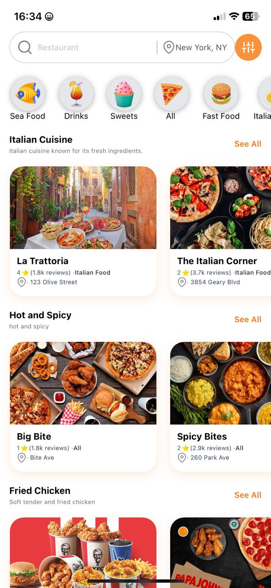
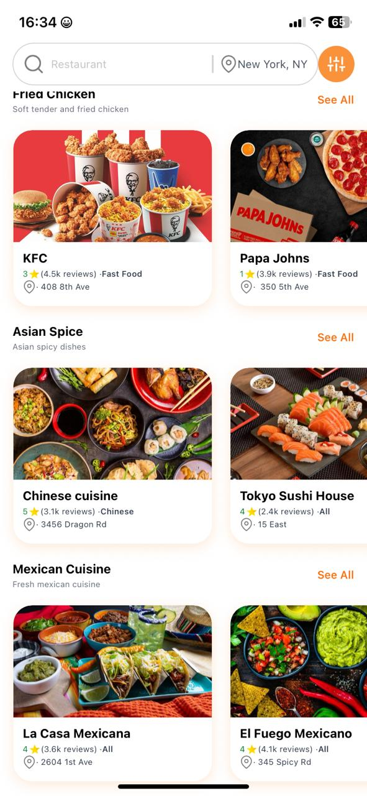
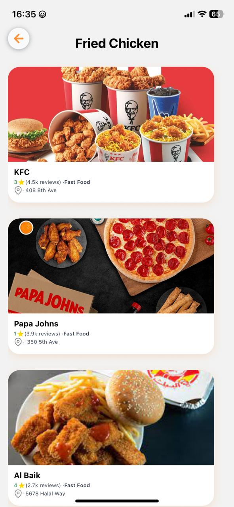
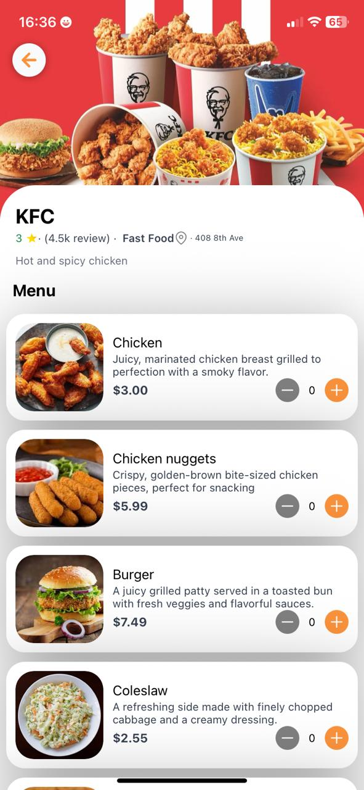
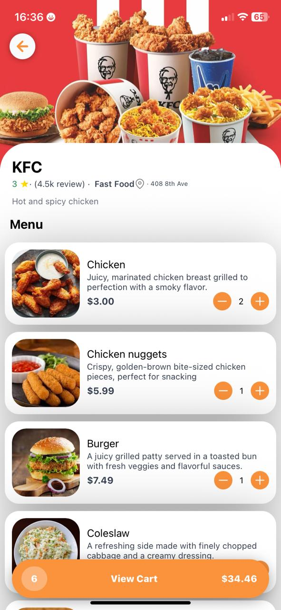
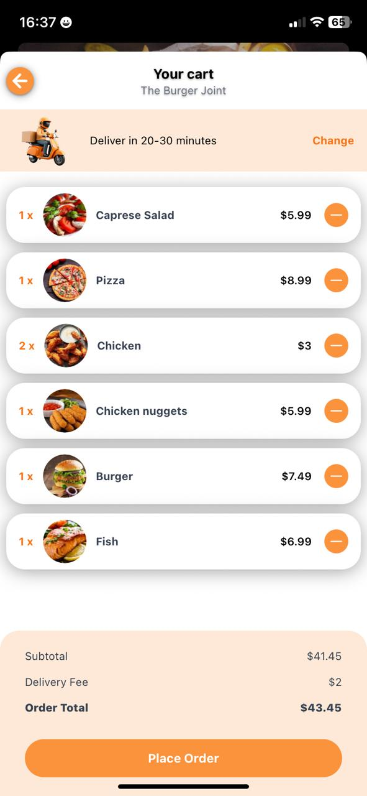
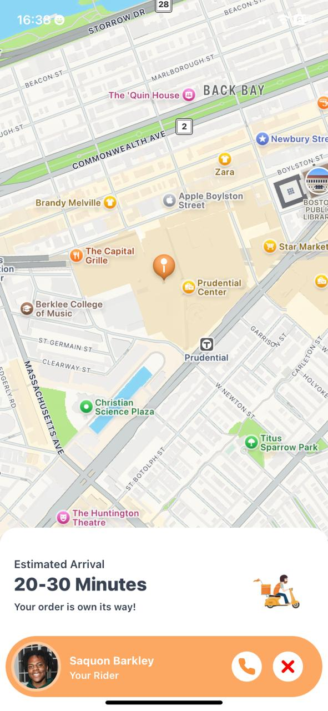

# ⚡🍔 FlashFeast – Speedy Food Delivery App

FlashFeast is a modern, fast, and clean food delivery app built using React Native, styled with NativeWind, managed with Redux Toolkit, and powered by Sanity CMS for dynamic content updates.  
From tasty bites to full-course meals, FlashFeast gets your food delivered at lightning speed.

[View on GitHub →](https://github.com/KennedyGakuru/FlashFeast)

---

<div align="center">
  
  
  
  
  
  
  
</div>

---

## ✨ Features

- 🍽️ Browse nearby restaurants and explore full menus  
- 🛵 Real-time order status and delivery tracking  
- 🌓 Light/Dark mode support  
- 🧠 Global state management with Redux Toolkit  
- 🧾 Dynamic content handled via Sanity CMS  
- 💅 Tailwind-style utility classes with NativeWind  

---

## 🛠️ Tech Stack

| Tech            | Description                                 |
|-----------------|---------------------------------------------|
| React Native    | Cross-platform mobile development           |
| NativeWind      | Tailwind-style styling in React Native      |
| Redux Toolkit   | Centralized and scalable state management   |
| Sanity CMS      | Real-time content management                |
| Expo            | Development workflow and build system       |

---

## 🚀 Getting Started

### 1. Clone the Repository

```bash
git clone https://github.com/KennedyGakuru/FlashFeast.git
cd flashfeast
